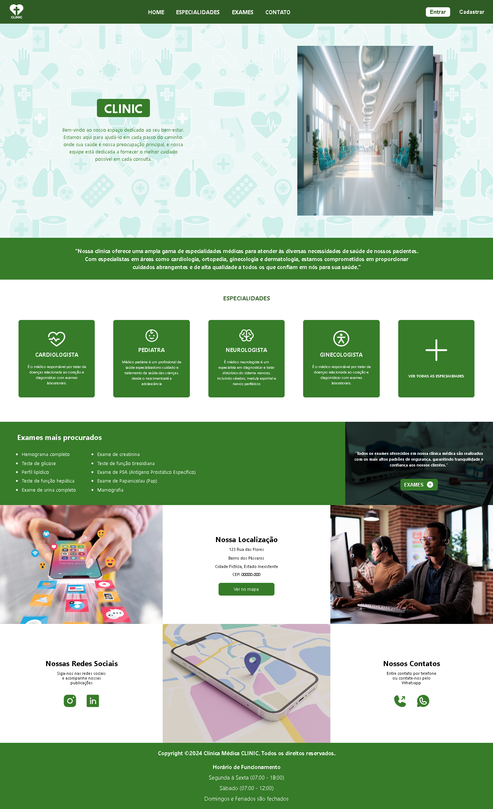

  <h1>CLINIC</h1>
  
<strong>The project was created for a medical clinic, showing the clinic's main types of services, such as: exams, specialties, location, contact.</strong>

  

  <h3>PROJECT</h3>
  

  
  

  <h3>SITE</h3>
  

  https://clinicmedicalclinic.netlify.app

